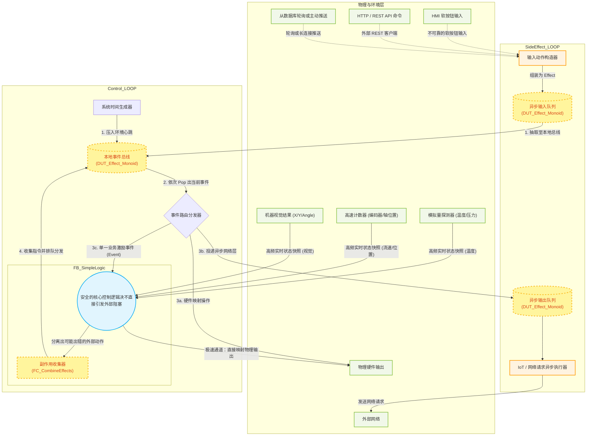

# MonoPLC 架构图与程序结构

本文档基于 `SideEffectPLC` 项目的实际代码结构（包括 `Control_LOOP`、`SideEffect_LOOP` 和 `FB_SimpleLogic`）绘制了核心数据流与事件循环架构。

## 1. 核心数据流与洋葱圈架构图

下面使用 Mermaid 语法展示了 MonoPLC 的单线程事件循环机制以及外围副作用解耦的数据流向：

## 2. 架构要点解析

根据代码结构，你的项目主要被分为严格隔离的三个层级：

1. **副作用层 (`SideEffect_LOOP`)**：
   - 负责与外部“脏”环境打交道。它将用户的非周期性点击（HMI Buttons）或 HTTP 报文，转换成为了统一标准的 `DUT_Effect`（通过 `FC_StartInputEffect` 等）并塞入 **异步输入队列 (`Async_Input_Queue`)**。
   - 它从 **异步输出队列 (`Async_Effect_Queue`)** 中提取需要耗时的网络操作（如 MQTT 发布、数据库写入等），在后台从容发送。这种设计**彻底剥离了网络延迟对 PLC 毫秒级主循环的致命阻塞威胁**。

2. **实时控制循环 (`Control_LOOP`)**：
   - 这是极高频循环（可能 1ms 级别）。它第一步先把外部送来的输入事件和本地生成的系统心跳（Tick）全部收编到 **本地事件总线 (`Event_Bus_Queue`)** 中。
   - 然后，开启一个强大的 **`WHILE` 循环路由分发器**。如果取出的事件是操作硬件，就立刻拉高拉低管脚；如果是发网络，就扔进异步队列交给 `SideEffect_LOOP`。如果是业务事件（比如按钮按了或者时间流逝了），才会喂给大脑进行思考。
   - 💡 **灵活性说明：事件路由并不是唯一的调度方式！**
     - 本示例中使用带有 `Event_Bus_Queue` 的单线程事件循环架构（类似 NodeJS 引擎），是一种非常纯粹但偏向极客的解法。
     - **开发者完全可以按照自己的习惯推翻这个循环。** 只要你把业务逻辑产出的 `DUT_Effect_Monoid` 从返回值里接住，直接用传统的层叠式 `IF` 语句、或者分配给不同的 Task 去分散执行，也完全可以达到同样的效果。洋葱圈的隔离边界依然成立。

3. **核心控制代码层 (`FB_SimpleLogic`)**：
   - 这是业务逻辑运算的大脑。在本项目示例中，它被最高阶地抽象为了一个**“纯函数” (Pure Function)**。
   - 它没有定时器，没有网络连接，不能直接控制管脚。它只接收**当前的僵死数据**（温度、字符串冻结时间）和一个引发思考的**单一输入事件**。
   - 它思考的结果，是产出一大堆**“想要做的副作用”结构体指令**（利用 `FC_CombineEffects` 收集打包）。
   - ⚠️ **重要架构声明：单纯的纯函数只是选项，不是限制！**
     - 例程中采用了极端严格的纯函数，只是为了展示 MonoPLC 框架在状态解耦上**能够达到多高的上限设计**。
     - **纯函数并绝对非本架构运行的前提条件**。只要你能做到“计算逻辑”与“导致阻塞或异常的副作用动作”物理隔离，哪怕你在 `FB_SimpleLogic` 内部依然使用传统的层级调用、状态机、甚至稍微包含一点本地可控的状态变量，只要最终产生的是 `DUT_Effect_Monoid` 数据集，这套洋葱结构依然能完美保护你的主程序免于外部环境的绞杀。
