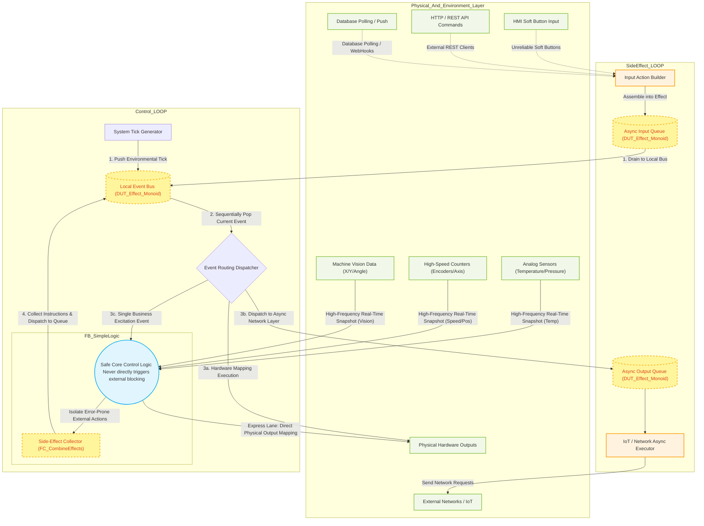

# MonoPLC Architecture Diagram and Program Structure

This document outlines the core data flow and event loop architecture based on the actual codebase structure of the `SideEffectPLC` project (including `Control_LOOP`, `SideEffect_LOOP`, and `FB_SimpleLogic`).

## 1. Core Data Flow and Onion Architecture Diagram

The Mermaid diagram below illustrates MonoPLC's single-thread event loop mechanism and how external side-effects are aggressively decoupled from the main logic flow:

## 2. Architecture Key Concepts

Based on the code structure, the project is divided into three strictly isolated tiers:

1. **Side-Effect Layer (`SideEffect_LOOP`)**:
   - Responsible for dealing with the "dirty" external environment. It converts unpredictable inputs (like HMI Button clicks or HTTP payloads) into standardized `DUT_Effect` structures (via functions like `FC_StartInputEffect`) and pushes them into the **`Async_Input_Queue`**.
   - It also extracts time-consuming network operations (e.g., MQTT publishing, Database writes) from the **`Async_Effect_Queue`** and transmits them calmly in the background. This design **completely eliminates the fatal threat of network latency blocking the PLC's millisecond-level main scan cycle**.

2. **Real-Time Control Loop (`Control_LOOP`)**:
   - This is the ultra-high-frequency loop (e.g., 1ms cycle time). As its first step, it ingests all incoming external events and the locally generated System Tick, consolidating them into the **`Event_Bus_Queue`**.
   - Next, it initiates a robust **`WHILE` Loop Event Dispatcher**. If the popped event demands hardware manipulation, it immediately toggles the physical pins. If it's a network request, it's routed sequentially to the `SideEffect_LOOP` via the async queue. If it represents a business logic trigger (e.g., a button press or the mere passage of time), only then is it fed into the core brain for computation.
   - 💡 **Flexibility Note: Event routing is NOT the only dispatch mechanism!**
     - This example employs a single-threaded event loop architecture (much like the Node.js engine) utilizing an `Event_Bus_Queue`. This is an extremely pure but highly geeky implementation.
     - **Developers are completely free to dismantle this loop.** As long as you catch the `DUT_Effect_Monoid` yielded by your business logic, you can dispatch it using traditional cascading `IF` statements or assign it across different PLC Tasks for relay execution. The Onion Architecture's isolation boundaries remain perfectly intact.

3. **Core Control Code Layer (`FB_SimpleLogic`)**:
   - This serves as the brain for business logic computation. In this project's exemplar, it is abstracted to the highest degree as a **"Pure Function"**.
   - It possesses no timers, maintains no network connections, and is barred from manipulating physical pins directly. It strictly receives the **frozen real-time data** (e.g., temperature, frozen timestamp strings) alongside a **single input event** that triggers its decision-making.
   - The output of its contemplation is a multitude of **"Desired Side-Effect" instruction sets** (collected and bundled using `FC_CombineEffects`).
   - ⚠️ **CRITICAL ARCHITECTURE DECLARATION: Pure Functions are merely an option, NOT a restriction!**
     - The example code employs an aggressively strict Pure Function approach simply to demonstrate **how remarkably high the ceiling for state decoupling can reach** under the MonoPLC framework.
     - **Implementing a Pure Function is absolutely not a prerequisite for this architecture to run.**
     - As long as you physically isolate your "computational logic" from the "error-prone side-effect actions" (like sending network requests or reading/writing files), you are perfectly safe. Even if you maintain traditional nested calls, State Machines (SFC), or retain a few controllable local state variables inside `FB_SimpleLogic`—as long as the final computed outcome is purely a `DUT_Effect_Monoid` data set, this Onion framework will flawlessly shield your main program from being compromised by external environments.
