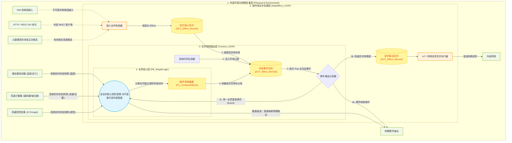

# MonoPLC: 基于 Monoid 的纯函数式 PLC 控制架构的数学模型与工业实践

## 1. 核心痛点：为什么传统的 PLC 架构会走向失控？

在传统的工业自动化编程（如 IEC 61131-3）中，我们往往直面底层硬件，而目前的趋势是混合比如IoT设备等新的设备：

```iecst
// 传统代码示例：灾难的温床
IF Temp > 80.0 THEN
    CoolingValve := TRUE;    
    StartTimer(IN:=TRUE);    
    MQTT_Send('Warning');    // 副作用：调用外部网络库发送字符串，可能导致 PLC 扫描周期拉长
END_IF
```

这种直接操作带来致命的工程问题：
**纯真逻辑与外部副作用的混淆（网络、IO、延迟互相纠缠）**
纯粹的商业逻辑（“什么时候该开水阀”）与底层通信（“怎么发 MQTT”、“怎么等待网络延迟而不阻塞 Task”）被捏合在一起。如果网络堵塞，直接调用 `MQTT_Send` 会拉爆整个毫秒级的实时 Task；一旦异步拉出了别的 Task，又会面临跨任务数据抢占互斥的噩梦。

---

## 2. 破局之道：引入 Monoid 代数结构

为了解决上述乱象，我们从抽象代数中借用了一个简单但极其强大的概念：**Monoid（幺半群）**。

### 什么是 Monoid？
在数学上，一个集合 $M$ 和其上的一个二元运算 $\circ$ 如果满足以下三个条件，就构成了一个 Monoid：
1. **封闭性 (Closure)**：对任意 $a, b \in M$，有 $a \circ b \in M$。
2. **结合律 (Associativity)**：对任意 $a, b, c \in M$，有 $(a \circ b) \circ c = a \circ (b \circ c)$。
3. **单位元 (Identity)**：存在一个元素 $e \in M$，使得对任意 $a \in M$，有 $e \circ a = a \circ e = a$。

### 为什么 Monoid 能拯救业务代码？
在 MonoPLC 架构中，我们将**所有的外部影响（无论输入信号还是输出动作）**抽象为**“Effect（副作用）”**的数据。而 `Effect` 集合通过一个合并运算，构成了 `Effect_Monoid`。

这意味着：
- **封闭性 (Closure)**：一个 Effect（如关水阀）和另一个 Effect（如发日志），合起来依然也是一个完全相同的 `DUT_Effect_Monoid` 类型。不仅逻辑接口极度统一，还能实现无穷尽的堆叠。处理 1 个操作和处理 100 个操作，在下游函数的入参定义上毫无区别：
  ```iecst
  Eff_Valve   := FC_ValveEffect('CoolingValve', FALSE); // 产生 1 个关阀副作用
  Eff_Network := FC_IoTEffect('mqtt/status', 'Stop');   // 产生 1 个网络副作用
  // 两个不同维度的操作合并，产生的仍是完全一样格式的 DUT_Effect_Monoid
  Effects_Out := FC_CombineEffects(Eff_Valve, Eff_Network); 
  ```

- **单位元 (Identity)**：如果这一毫秒的扫描周期内风平浪静，我们返回的并不是传统的“直接 RETURN 不做什么（Void/No-Op）”，或者是“返回一个 NULL 指针”，而是坚持返回一个“空的 Monoid”：
  ```iecst
  // 没有触发任何事件，返回一个 Count = 0, 空数组的 Monoid
  Effects_Out := FC_EmptyEffect(); 
  ```
  这彻底消除了下游函数处理空数据时那些丑陋的 `IF pData <> 0 THEN` 等边界空数组判断。任何事物加上了 `FC_EmptyEffect()` 都依然等于它最初的自己。

- **结合律 (Associativity)**：这是应对多重并发和异步通信的关键。无论是 Task A 本地从 HMI 收到的直接电信号，还是 Task B 从网络 IoT 协议解析出的间接命令，只要它们都遵循这个 Monoid 规则，开发者就可以随意将它们像数学加法一样折叠：
  ```iecst
  // 无论先加哪个，或者在哪一步加，结果毫无区别： (网 + 屏) + 物理管脚 = 网 + (屏 + 物理管脚)
  Total_Input_Monoid := FC_CombineEffects(IoT_Input_Monoid, HMI_Input_Monoid);
  Total_Input_Monoid := FC_CombineEffects(Total_Input_Monoid, Physical_Input_Monoid);
  ```
  无论是在什么核心的哪个 Task 里、以何种顺序合并，最终传递给纯逻辑处理函数的，永远都是一个清洗干净、合并规整的抽象“输入数据集合”。

---

## 3. MonoPLC 详细架构实现

### 3.1 数据定义与单位元 （The Types & Identity）

我们首先定义单一的 `DUT_Effect` 结构体，它是纯粹的数据声明（Declarative），而不是可执行的动作动作（Imperative）。
```iecst
TYPE DUT_Effect :
STRUCT
	EType   : ENUM_Effect_Type; // 例如 EFF_VALVE_CTRL, EFF_IOT_PUB
	Target  : STRING[32];       // 对象，例如 'CoolingValve'
	Value   : REAL;             // 例如 1.0 (TRUE/ON)
END_STRUCT
END_TYPE
```

接着，利用它组合出代表整个状态集或行为集的 `DUT_Effect_Monoid`：
```iecst
TYPE DUT_Effect_Monoid :
STRUCT
	Count   : INT := 0; 
    Effects : ARRAY[1..20] OF DUT_Effect;
END_STRUCT
END_TYPE
```
其中，`FC_EmptyEffect()` 函数返回一个 `Count = 0` 且清零初始化的结构体，充当了代数中的**单位元**。

### 3.2 组合函数 (The Combinator)

`FC_CombineEffects` 函数充当了 Monoid 的那个二元运算符号 $\circ$：
```iecst
FUNCTION FC_CombineEffects : DUT_Effect_Monoid
VAR_INPUT
    M1 : DUT_Effect_Monoid;
    M2 : DUT_Effect_Monoid;
END_VAR
// ... 将两个数组合并，返回一个新的结构体
```
有了它，任何复杂的复合动作，最终都可以规约为**纯天然的数据打包**。

> [!NOTE]
> 在本项目的示例代码中，我们采用的是最直观的 **FIFO 定长数组追加** 方式来实现 Effect 的结合律（即 `M1 + M2` 会把 `M2` 里的事件依次排在 `M1` 的末尾）。
> 
> 但请注意：**这并不是唯一的合并方式。** 只要满足数学上的封闭性和结合律，在不同的应用场景中，你可以采用：
> - **环形缓冲区 (Ring Buffer)** 拼接，用于极高频场景以避免大量数组循环拷贝开销。
> - **链表 (Linked List)** 拼接，用于支持动态内存分配的现代控制系统 (如 TwinCAT 3 的 `__NEW`)。
> - **带优先级的去重合并**（例如 `M1` 里有一个关阀门，`M2` 里也有一个，合并时丢掉一个重复的），只要逻辑自圆其说。
> 
> Monoid 架构设计的重点在于**接口的抽象和约束**，它从根本上屏蔽了底层数据结构是如何堆叠的物理细节。

### 3.3 核心数据流与洋葱圈架构图

下面使用 Mermaid 语法展示了 MonoPLC 的单线程事件循环机制以及外围副作用解耦的数据流向：



### 3.4 架构要点解析

根据代码结构，你的项目主要被分为严格隔离的三个层级：

1. **副作用层 (`SideEffect_LOOP`)**：
   - 负责与外部“脏”环境打交道。它将用户的非周期性点击（HMI Buttons）或 HTTP 报文，转换成为了统一标准的 `DUT_Effect`（通过 `FC_StartInputEffect` 等）并塞入 **异步输入队列 (`Async_Input_Queue`)**。
   - 它从 **异步输出队列 (`Async_Effect_Queue`)** 中提取需要耗时的网络操作（如 MQTT 发布、数据库写入等），在后台从容发送。这种设计**彻底剥离了网络延迟对 PLC 毫秒级主循环的致命阻塞威胁**。

2. **实时控制循环 (`Control_LOOP`)**：
   - 这是极高频循环（可能 1ms 级别）。它第一步先把外部送来的输入事件和本地生成的系统心跳（Tick）全部收编到 **本地事件总线 (`Event_Bus_Queue`)** 中。
   - 然后，开启一个强大的 **`WHILE` 循环路由分发器**。如果取出的事件是操作硬件，就立刻拉高拉低管脚；如果是发网络，就扔进异步队列交给 `SideEffect_LOOP`。如果是业务事件（比如按钮按了或者时间流逝了），才会喂给大脑进行思考。
   - 💡 **灵活性说明：事件路由并不是唯一的调度方式！**
     - 本示例中使用带有 `Event_Bus_Queue` 的单线程事件循环架构（类似 NodeJS 引擎），是一种非常纯粹但偏向极客的解法。
     - **开发者完全可以按照自己的习惯推翻这个循环。** 只要你把业务逻辑产出的 `DUT_Effect_Monoid` 从返回值里接住，直接用传统的层叠式 `IF` 语句、或者分配给不同的 Task 去分散执行，也完全可以达到同样的效果。洋葱圈的隔离边界依然成立。

3. **核心控制代码层 (`FB_SimpleLogic`)**：
   - 这是业务逻辑运算的大脑。在本项目示例中，它被最高阶地抽象为了一个**“纯函数” (Pure Function)**。
   - 它没有定时器，没有网络连接，不能直接控制管脚。它只接收**当前的僵死数据**（温度、字符串冻结时间）和一个引发思考的**单一输入事件**。
   - 它思考的结果，是产出一大堆**“想要做的副作用”结构体指令**（利用 `FC_CombineEffects` 收集打包）。
   - ⚠️ **重要架构声明：单纯的纯函数只是选项，不是限制！**
     - 例程中采用了极端严格的纯函数，只是为了展示 MonoPLC 框架在状态解耦上**能够达到多高的上限设计**。
     - **纯函数并绝对非本架构运行的前提条件**。只要你能做到“计算逻辑”与“导致阻塞或异常的副作用动作”物理隔离，哪怕你在 `FB_SimpleLogic` 内部依然使用传统的层级调用、状态机、甚至稍微包含一点本地可控的状态变量，只要最终产生的是 `DUT_Effect_Monoid` 数据集，这套洋葱结构依然能完美保护你的主程序免于外部环境的绞杀。

---

## 4. MonoPLC 架构的极大优势细节

### 4.1 核心层免疫一切网络/时序阻塞
传统的网络发送代码（如调用 HTTP REST API）可能会占用 100~500 毫秒。如果写在实时主干代码里，会干扰代码运行。
在 MonoPLC 中，纯逻辑 `FB_SimpleLogic` 永远只耗费不到 1 毫秒计算并吐出了 `Target='mqtt'` 的 Effect 结构体。随后路由层秒速把它丢进带有指针锁的 `Async_Queue` 中跳出。网络发送库可以放在一个极低优先级（甚至 500ms Cycle）的副程式里慢慢轮询队列。


### 4.2 水平扩展：任意新增设备而不碰主线循环
传统项目加多一个按钮，需要在各种 IF 分支里狂塞 `OR Btn3 OR Btn4`，一旦接外网还会多出大量的边缘条件甚至指针错误。
利用 Monoid：HMI 按下 Start 按钮？没问题，把它组装成一个带有 `'Start'` 类型标签的 `Input_Effect` Monoid 扔进共享队列里。因为此时结合律又发挥了威力：我们只是在做数学上的**集合加法**！
主控函数的轮询逻辑（`FOR i := 1 TO Inputs_In.Count DO`）甚至连一个标点符号都不需要动，它自己就能处理所有并发的新输入。

### 4.5 终极大一统：副作用彻底分离之后的架构自由 (The Freedom of Side-Effect Separation)
需要特别说明的是，不管是我们前文聊到的三阶段“洋葱圈模型”，还是接下来我们要展示的“单线程事件循环”，它们都**仅仅是程序的外部骨架，绝不是 MonoPLC 架构的最终目的**。

MonoPLC 架构的真正核心与最终目的永远只有一个：**将“纯粹计算逻辑”与“对外部产生副作用（Side Effect）的执行”彻底剥离。**

正是因为业务运算只产生作为中介数据包的 `DUT_Effect_Monoid`，而绝不去直接触模物理引脚或网络底层接口，所以**开发者拥有了对外部框架拥有随心所欲的改造自由**。

譬如说，为了追求极致的异步表现，开发者完全可以凭个人喜好，瞬间把 `Control_LOOP` 重构成一个类似于 **Node.js 引擎** 或 **现代 Actor 模型** 的单线程事件循环架构，而里面的核心纯逻辑模块 `FB_SimpleLogic` 甚至连一行代码都不需要动：

1. **构建统一事件总线**：在 PLC 内存里设置一个极高频的循环队列 `Event_Bus_Queue`，将任何输入（HMI 命令、代表时钟流逝的 `EFF_SYSTEM_TICK`）和任何需要执行的输出（控制硬件），全都一视同仁地当做“事件”。
2. **事件路由循环（The Router）**：启动一个 `WHILE 队列不为空` 的分发器，弹出一个事件就跑去分发一次（控制阀门的去写 IO，要发网文的丢给后台）。
3. **副作用递归反馈（Event Recursion）**：如果弹出的是提供给大脑的指令（如 `TICK`），就送给纯函数计算。计算出来的“输出副作用（Effects）”**绝不立刻执行**，而是反手**作为新事件，完全丢回 `Event_Bus_Queue` 的尾巴上排队**，等待循环引擎自己慢慢消化。

这些重构的灵活性仅仅是副作用隔离带来的副产物。当你实现了系统状态与副作用执行的彻底解耦，无论外部采用何种运行框架（传统的线性扫描或事件驱动循环），都可以根据工程实际需求进行切换，而核心控制代码本身无需修改。

## 5. 总结

MonoPLC 探索了将函数式编程与数学概念引入 PLC（可编程逻辑控制器）开发的可行性。我们在一定程度上缓解了工业控制软件中常见的逻辑纠缠与状态冲突问题。这种将外部物理环境交互与内部业务逻辑进行物理隔离的设计模式，为提高大型自动化控制代码的可测试性、可维护性以及系统的长期稳定性，提供了一种工程参考。
