# MonoPLC: Mathematical Model and Industrial Practice of a Pure Functional PLC Control Architecture based on Monoids

## 1. Core Pain Point: Why Do Traditional PLC Architectures Fall Out of Control?

In traditional industrial automation programming (such as IEC 61131-3), we often directly interface with underlying hardware. However, the current trend is to mix in new devices, such as IoT equipment:

```iecst
// Traditional code example: A breeding ground for disasters
IF Temp > 80.0 THEN
    CoolingValve := TRUE;    
    StartTimer(IN:=TRUE);    
    MQTT_Send('Warning');    // Side effect: Calling an external network library to send a string might prolong the PLC scan cycle
END_IF
```

This kind of direct manipulation brings about fatal engineering problems:
**The entanglement of pure logic and external side effects (network, IO, and delays intertwined)**
Pure business logic ("when to open the water valve") is mashed together with low-level communication ("how to send MQTT", "how to wait for network delay without blocking the Task"). If the network is congested, directly calling `MQTT_Send` will crash the entire millisecond-level real-time Task; if it's pushed asynchronously to another Task, it introduces the nightmare of cross-task data preemption and mutual exclusion.

---

## 2. Introducing the Monoid Algebraic Structure

To resolve the chaos mentioned above, we borrow a simple yet incredibly powerful concept from abstract algebra: the **Monoid**.

### What is a Monoid?
In mathematics, a set $M$ equipped with a binary operation $\circ$ forms a Monoid if it satisfies the following three conditions:
1. **Closure**: For all $a, b \in M$, the result of $a \circ b$ is also in $M$.
2. **Associativity**: For all $a, b, c \in M$, the equation $(a \circ b) \circ c = a \circ (b \circ c)$ holds.
3. **Identity Element**: There exists an element $e \in M$, such that for every $a \in M$, the equations $e \circ a = a \circ e = a$ hold.

### Why Can Monoids Help?
In the MonoPLC architecture, we abstract **all external impacts (whether input signals or output actions)** into **"Effect"** data. The `Effect` set, combined through a merge operation, forms an `Effect_Monoid`.

This means:
- **Closure**: Combining one Effect (e.g., closing a water valve) with another Effect (e.g., sending a log) still results in the exact same `DUT_Effect_Monoid` type. Not only is the logical interface extremely uniform, but it also allows for endless stacking. Processing 1 operation versus 100 operations makes no difference in the input parameter definitions of downstream functions:
  ```iecst
  Eff_Valve   := FC_ValveEffect('CoolingValve', FALSE); // Generates 1 closing valve side effect
  Eff_Network := FC_IoTEffect('mqtt/status', 'Stop');   // Generates 1 network side effect
  // Merging operations from two different dimensions still produces the exact same format of DUT_Effect_Monoid
  Effects_Out := FC_CombineEffects(Eff_Valve, Eff_Network); 
  ```

- **Identity**: If nothing happens during the millisecond scan cycle, we do not return the traditional "direct RETURN doing nothing (Void/No-Op)" or a "NULL pointer". Instead, we insist on returning an "Empty Monoid":
  ```iecst
  // No events triggered, returning a Monoid with Count = 0 and an empty array
  Effects_Out := FC_EmptyEffect(); 
  ```
  This completely eliminates those ugly boundary array checks like `IF pData <> 0 THEN` when downstream functions handle empty data. Anything combined with `FC_EmptyEffect()` remains equally itself.

- **Associativity**: This is the key to handling multiple concurrencies and asynchronous communication. Whether it's direct electrical signals received locally by Task A from the HMI, or indirect commands parsed from the network IoT protocol by Task B, as long as they follow the Monoid rules, developers can fold them together freely like mathematical addition:
  ```iecst
  // No matter which is added first, or at what step they are added, the result is identical: (Network + Screen) + Physical Pins = Network + (Screen + Physical Pins)
  Total_Input_Monoid := FC_CombineEffects(IoT_Input_Monoid, HMI_Input_Monoid);
  Total_Input_Monoid := FC_CombineEffects(Total_Input_Monoid, Physical_Input_Monoid);
  ```
  No matter which core's Task it is in, or in what out-of-order sequence they are merged, what is eventually passed to the pure logic processing function is always a cleanly washed, neatly merged abstract "input data set".

---

## 3. MonoPLC Detailed Architecture Implementation

### 3.1 Data Definitions and the Identity Element (The Types & Identity)

First, we define a single `DUT_Effect` structure, which is purely declarative data, not an executable imperative action.
```iecst
TYPE DUT_Effect :
STRUCT
	EType   : ENUM_Effect_Type; // E.g., EFF_VALVE_CTRL, EFF_IOT_PUB
	Target  : STRING[32];       // Object, e.g., 'CoolingValve'
	Value   : REAL;             // E.g., 1.0 (TRUE/ON)
END_STRUCT
END_TYPE
```
**Why do we need a `Target` field?**
In this system where everything is an event, `EType` is just a broad category of action (e.g., `Open Valve` or `Send Network Message`). If you have 10 different water valves, or you want to publish to 10 different MQTT topics, you don't need to define 10 Enum types. You only need to set `Target` to `'CoolingValve'` or `'DrainValve'` when generating the Effect. In the final routing layer of the Event Loop, it looks at this `Target` string and accurately routes the digital conversion to the corresponding physical pin (`GVL.Valve_A := ...`). This greatly enhances the versatility of the structure.

Next, we use it to construct `DUT_Effect_Monoid`, which represents the entire set of states or behaviors:
```iecst
TYPE DUT_Effect_Monoid :
STRUCT
	Count   : INT := 0; 
    Effects : ARRAY[1..20] OF DUT_Effect;
END_STRUCT
END_TYPE
```
Among them, the `FC_EmptyEffect()` function returns a structurally zero-initialized struct with `Count = 0`, acting as the **Identity Element** in algebra.

### 3.2 Combinator Function (The Combinator)

The `FC_CombineEffects` function serves as the binary operation symbol $\circ$ in the Monoid:
```iecst
FUNCTION FC_CombineEffects : DUT_Effect_Monoid
VAR_INPUT
    M1 : DUT_Effect_Monoid;
    M2 : DUT_Effect_Monoid;
END_VAR
// ... Merges two arrays and returns a new structure
```
With it, any complex composite action can ultimately be reduced to **pure, natural data packaging**.

> [!NOTE]
> In the sample code of this project, we utilize the most straightforward **FIFO fixed-length array append** approach to implement the associativity of Effects (i.e., `M1 + M2` will sequentially append the events in `M2` to the end of `M1`).
> 
> However, please note: **This is not the only way to merge them.** As long as the mathematical properties of closure and associativity are satisfied, you can adopt the following in different application scenarios:
> - **Ring Buffer** concatenation, used for ultra-high-frequency scenarios to avoid the massive overhead of array loop copying.
> - **Linked List** concatenation, used for modern control systems supporting dynamic memory allocation (like `__NEW` in TwinCAT 3).
> - **Deduplication merge with priority** (e.g., if there is a 'close valve' in `M1` and also one in `M2`, discard the duplicate upon merging), as long as the logic is coherent.
> 
> The focus of the Monoid architecture design lies in the **abstraction and constraints of the interfaces**, which fundamentally shields you from the physical details of how the underlying data structures are stacked.

### 3.3 Core Data Flow and Onion Architecture Diagram

The Mermaid diagram below illustrates MonoPLC's single-thread event loop mechanism and how external side-effects are aggressively decoupled from the main logic flow:

```mermaid
flowchart TD
    subgraph Layer_Env ["1. Physical & Environment Layer"]
        HMI_Input["HMI Soft Button Input"]
        Web_Input["HTTP / REST API Commands"]
        DB_Input["Database Polling / Push"]
        Sensor_Temp["Analog Sensors (Temperature/Pressure)"]
        Sensor_Enc["High-Speed Counters (Encoders/Axis)"]
        Sensor_Vis["Machine Vision Data (X/Y/Angle)"]
        HardwareOut[Physical Hardware Outputs]
        Network[External Networks / IoT]

        subgraph Layer_SideEffect ["2. Side-Effect Loop Layer (Async)"]
            InputBuilder[Input Action Builder]
            AsyncInputQ[("Async Input Queue (DUT_Effect_Monoid)")]
            AsyncEffectQ[("Async Output Queue (DUT_Effect_Monoid)")]
            IoTExecutor["IoT / Network Async Executor"]
            
            subgraph Layer_Control ["3. Real-Time Control Loop Layer"]
                EventBus[("Local Event Bus (DUT_Effect_Monoid)")]
                TickGen["System Tick Generator"]
                Router{"Event Routing Dispatcher"}
                
                subgraph Layer_Core ["4. Core Control Logic Layer (FB_SimpleLogic)"]
                    SafeCore((Safe Core Control Logic Never directly triggers external blocking))
                    MonoidMerge["Side-Effect Collector (FC_CombineEffects)"]
                end
            end
        end
    end

    %% ==== Data Flow Connections ====
    HMI_Input -.->|"Unreliable Soft Buttons"| InputBuilder
    Web_Input -.->|"External REST Clients"| InputBuilder
    DB_Input -.->|"Database Polling / WebHooks"| InputBuilder
    InputBuilder -->|"Assemble into Effect"| AsyncInputQ
    
    AsyncEffectQ --> IoTExecutor
    IoTExecutor -->|"Send Network Requests"| Network

    AsyncInputQ -->|"1. Drain to Local Bus"| EventBus
    TickGen -->|"1. Push Environmental Tick"| EventBus
    
    EventBus -->|"2. Sequentially Pop Current Event"| Router
    
    Router -->|"3a. Hardware Mapping Execution"| HardwareOut
    Router -->|"3b. Dispatch to Async Network Layer"| AsyncEffectQ
    Router -->|"3c. Single Business Excitation Event"| SafeCore
    
    Sensor_Temp -->|"High-Frequency Real-Time Snapshot (Temp)"| SafeCore
    Sensor_Enc -->|"High-Frequency Real-Time Snapshot (Speed/Pos)"| SafeCore
    Sensor_Vis -->|"High-Frequency Real-Time Snapshot (Vision)"| SafeCore
    SafeCore -->|"Isolate Error-Prone External Actions"| MonoidMerge
    SafeCore -->|"Express Lane: Direct Physical Output Mapping"| HardwareOut
    MonoidMerge -->|"4. Collect Instructions & Dispatch to Queue"| EventBus

classDef safeCore fill:#e1f5fe,stroke:#03a9f4,stroke-width:2px;
classDef sideEffect fill:#fff3e0,stroke:#ff9800,stroke-width:2px;
classDef hardware fill:#f1f8e9,stroke:#8bc34a,stroke-width:2px;
classDef queues fill:#f3e5f5,stroke:#9c27b0,stroke-width:1px,stroke-dasharray: 5 5;
classDef monoidFeature fill:#fff59d,stroke:#fbc02d,stroke-width:3px,color:#d84315,stroke-dasharray: 5 5;

class SafeCore safeCore;
class InputBuilder,IoTExecutor sideEffect;
class HMI_Input,Web_Input,DB_Input,Sensor_Temp,Sensor_Enc,Sensor_Vis,HardwareOut,Network hardware;
class AsyncInputQ,AsyncEffectQ,EventBus,MonoidMerge monoidFeature;
```



### 3.4 Architecture Key Concepts

Based on the code structure, the project is divided into three strictly isolated tiers:

1. **Side-Effect Layer (`SideEffect_LOOP`)**:
   - Responsible for dealing with the "dirty" external environment. It converts unpredictable inputs (like HMI Button clicks or HTTP payloads) into standardized `DUT_Effect` structures (via functions like `FC_StartInputEffect`) and pushes them into the **`Async_Input_Queue`**.
   - It also extracts time-consuming network operations (e.g., MQTT publishing, Database writes) from the **`Async_Effect_Queue`** and transmits them calmly in the background. This design **completely eliminates the fatal threat of network latency blocking the PLC's millisecond-level main scan cycle**.

2. **Real-Time Control Loop (`Control_LOOP`)**:
   - This is the ultra-high-frequency loop (e.g., 1ms cycle time). As its first step, it ingests all incoming external events and the locally generated System Tick, consolidating them into the **`Event_Bus_Queue`**.
   - Next, it initiates a robust **`WHILE` Loop Event Dispatcher**. If the popped event demands hardware manipulation, it immediately toggles the physical pins. If it's a network request, it's routed sequentially to the `SideEffect_LOOP` via the async queue. If it represents a business logic trigger (e.g., a button press or the mere passage of time), only then is it fed into the core brain for computation.
   - 💡 **Flexibility Note: Event routing is NOT the only dispatch mechanism!**
     - This example employs a single-threaded event loop architecture (much like the Node.js engine) utilizing an `Event_Bus_Queue`. This is an extremely pure but highly geeky implementation.
     - **Developers are completely free to dismantle this loop.** As long as you catch the `DUT_Effect_Monoid` yielded by your business logic, you can dispatch it using traditional cascading `IF` statements or assign it across different PLC Tasks for relay execution. The Onion Architecture's isolation boundaries remain perfectly intact.

3. **Core Control Code Layer (`FB_SimpleLogic`)**:
   - This serves as the brain for business logic computation. In this project's exemplar, it is abstracted to the highest degree as a **"Pure Function"**.
   - It possesses no timers, maintains no network connections, and is barred from manipulating physical pins directly. It strictly receives the **frozen real-time data** (e.g., temperature, frozen timestamp strings) alongside a **single input event** that triggers its decision-making.
   - The output of its contemplation is a multitude of **"Desired Side-Effect" instruction sets** (collected and bundled using `FC_CombineEffects`).
   - ⚠️ **CRITICAL ARCHITECTURE DECLARATION: Pure Functions are merely an option, NOT a restriction!**
     - The example code employs an aggressively strict Pure Function approach simply to demonstrate **how remarkably high the ceiling for state decoupling can reach** under the MonoPLC framework.
     - **Implementing a Pure Function is absolutely not a prerequisite for this architecture to run.**
     - As long as you physically isolate your "computational logic" from the "error-prone side-effect actions" (like sending network requests or reading/writing files), you are perfectly safe. Even if you maintain traditional nested calls, State Machines (SFC), or retain a few controllable local state variables inside `FB_SimpleLogic`—as long as the final computed outcome is purely a `DUT_Effect_Monoid` data set, this Onion framework will flawlessly shield your main program from being compromised by external environments.

---

## 4. Details of the Great Advantages of the MonoPLC Architecture

### 4.1 The Core Layer is Immune to All Network/Timing Blockages
Traditional network sending code (e.g., calling an HTTP REST API) might consume 100~500 milliseconds. If written inside the main real-time trunk code, it will interfere with the code execution.
In MonoPLC, the pure logic `FB_SimpleLogic` will always spend less than 1 millisecond calculating and spitting out an Effect struct with `Target='mqtt'`. Immediately after, the routing layer tosses it into the `Async_Queue` protected by pointer locks and quickly exits. The network sending library can be placed in a sub-program with minimal priority (e.g., 500ms Cycle) to poll the queue slowly.

### 4.2 Event Idempotence and the Eradication of Zombie Vulnerabilities
In scattered traditional PLC logic, there is often implicit state coupling and race conditions: multiple pieces of code might simultaneously operate on outputs, resulting in the last one overwriting winning. Furthermore, after a stop command is issued, if the next line detects a high water temperature and turns the actuator back on, it forms what is known as a "Zombie State Machine" — the code essentially degrades into reflexes based on global states.

When a user presses "Stop" once via the HMI, in the older generation code, this maps to these messy overriding conflicts.
In this new architecture, if the HMI sends an `EFF_IOT_CMD_STOP` Effect, once the pure logic parses it, the response it makes is not an "action statement" but a "declarative output":
```iecst
System_En := FALSE;
Eff_Valve := FC_ValveEffect('CoolingValve', FALSE);
```
Since what is output here is not an action command, but a target state statement (fixing the cooling valve at the FALSE state), this is innately **Idempotent**. Even if the HMI freezes and sends twenty stop commands continuously, it equates to receiving just one command.
Simultaneously, leveraging the transversality of purely analyzing data, internal business states (like `System_En`) will forcefully sever parasitic reflex activations caused by temperature jumps, **eradicating the most notorious zombie state machines right from the source.**

### 4.3 "Time-Travel" and Replay Debugging (Time-Travel Debugging)
Since all external stimuli have been transformed by Stage A into the uniformly memory-formatted `Input_Monoid`; and all behaviors have become `Total_Out_Monoid` recorded in memory.
This means we can freely add "recording functionality"!
We can record each major cycle's `[Environment Time, Environment Temperature, Inputs_In]` as slices. Should a major downtime incident occur, we can import these files back into a virtual PLC runtime environment and run it again. Since `FB_SimpleLogic` is a 100% pure function devoid of external calls, given identical inputs, **it will 100% flawlessly reproduce the exact decisions made at the incident scene verbatim!**

### 4.4 Horizontal Scaling: Adding Any Devices Without Touching the Main Loop
Adding an extra button in a traditional project requires stuffing `OR Btn3 OR Btn4` crazily into various IF branches, and if connected to an external network, it generates a massive amount of edge cases and even pointer errors.
By leveraging Monoids: HMI presses the Start button? No problem, assemble it into an `Input_Effect` Monoid tagged with `'Start'` and throw it into the shared queue. Because associativity works its magic again here: we are merely doing mathematical **Set Addition**!
The polling logic of the main control function (`FOR i := 1 TO Inputs_In.Count DO`) doesn't even need a single punctuation mark altered; it can handle all concurrent new inputs entirely on its own.

### 4.5 The Ultimate Unification: Architectural Freedom Following Complete Side-Effect Separation
It must be particularly clarified that whether it's the three-stage "onion model" we talked about earlier, or the "single-threaded event loop" we are about to demonstrate, they are **merely the external skeleton of the program, and by no means the ultimate goal of the MonoPLC architecture**.

The true core and ultimate purpose of the MonoPLC architecture are always one: **To completely separate "pure calculation logic" from "the execution of side effects generated upon the external world".**

Precisely because business computations only generate `DUT_Effect_Monoid` as intermediate data packets, without ever directly touching physical pins or low-level network interfaces, **developers are granted the freedom to modify the external framework entirely at whim**.

For instance, to pursue extreme asynchronous performance, a developer could, purely out of personal preference, instantly refactor `Control_LOOP` into a single-threaded event loop architecture akin to a **Node.js engine** or a **modern Actor model**, all without needing to change a single line of code inside the core pure logic module `FB_SimpleLogic`:

1. **Construct a Unified Event Bus**: Set up an ultra-high-frequency circular queue `Event_Bus_Queue` in the PLC memory, treating any inputs (HMI commands, `EFF_SYSTEM_TICK` representing the passing of clock time) and any outputs requiring execution (controlling hardware) equally as "Events".
2. **Event Routing Loop (The Router)**: Initiate a `WHILE queue is not empty` dispatcher, popping out an event and dispatching it right away (write IO for controlling valves, throw into the background for sending network texts).
3. **Event Recursion**: If the popped event is a command provided to the brain (like `TICK`), send it to the pure function for calculation. The resulting "Output Side Effects" are **never executed immediately**, but inversely **queued back up as new events at the tail of the `Event_Bus_Queue`**, waiting for the loop engine to digest them slowly.

The flexibility of these refactorings is merely a byproduct derived from side-effect isolation. When you achieve the complete decoupling of system states and the execution of side effects, no matter what operating framework the exterior adopts (traditional linear scanning or event-driven loops), it can be switched according to practical engineering needs, all while the core control code itself requires no modification.

## 5. Conclusion

MonoPLC explores the feasibility of introducing functional programming and mathematical concepts into PLC (Programmable Logic Controller) development. By utilizing **Data Stream** abstraction to replace traditional **direct state manipulation**, we have, to a certain extent, mitigated the common issues of logical entanglement and state conflicts in industrial control software. This design pattern, which physically isolates external physical environment interactions from internal business logic, provides a valuable engineering reference for improving the testability, maintainability, and long-term stability of large-scale automated control code.
