# MonoPLC: Mathematical Model and Industrial Practice of a Side-Effect-Free PLC Control Architecture based on Monoids
**Author:** Xiaoxiao Zhang

## 1. Challenges and Limitations of Traditional PLC Architectures

In traditional industrial automation programming (such as IEC 61131-3), we often directly interface with underlying hardware. However, the current trend is to mix in new devices, such as IoT equipments:

```iecst
// Traditional code example: A breeding ground for disasters
IF Temp > 80.0 THEN
    CoolingValve := TRUE;    
    StartTimer(IN:=TRUE);    
    MQTT_Send('Warning');    // Side effect: Calling an external network library to send a string might prolong the PLC scan cycle
END_IF
```

This kind of direct manipulation brings about fatal engineering problems:
**The entanglement of pure logic and external side effects (network, IO, and delays intertwined)**
Pure business logic ("when to open the water valve") is mashed together with low-level communication ("how to send MQTT", "how to wait for network delay without blocking the Task"). If the network is congested, directly calling `MQTT_Send` will cause problems for the entire millisecond-level real-time Task.

---

## 2. Introducing the Monoid Algebraic Structure

To resolve the chaos mentioned above, we borrow a simple yet powerful concept from abstract algebra: the **Monoid**.

### What is a Monoid?
In mathematics, a set $M$ equipped with a binary operation $\circ$ forms a Monoid if it satisfies the following three conditions:
1. **Closure**: For all $a, b \in M$, the result of $a \circ b$ is also in $M$.
2. **Associativity**: For all $a, b, c \in M$, the equation $(a \circ b) \circ c = a \circ (b \circ c)$ holds.
3. **Identity Element**: There exists an element $e \in M$, such that for every $a \in M$, the equations $e \circ a = a \circ e = a$ hold.

### Why Can Monoids Help?
In the MonoPLC architecture, we abstract **all external impacts (whether input signals or output actions)** into **"Effect"** data. The `Effect` set, combined through a merge operation, forms an `Effect_Monoid`.

This means:
- **Closure**: Combining one Effect (e.g., cooling valve state publish to a phone) with another Effect (e.g., sending a log) still results in the exact same `DUT_Effect_Monoid` type. Not only is the logical interface extremely uniform, but it also allows for extensive stacking. Processing 1 operation versus 100 operations makes no difference in the input parameter definitions of downstream functions:
  ```iecst
  Eff_Valve   := FC_ValveEffect('CoolingValve', FALSE); // Generates 1 closing valve side effect
  Eff_Network := FC_IoTEffect('mqtt/status', 'Stop');   // Generates 1 network side effect
  // Merging operations from two different dimensions still produces the exact same format of DUT_Effect_Monoid
  Effects_Out := FC_CombineEffects(Eff_Valve, Eff_Network); 
  ```

- **Identity**: If nothing happens during the millisecond scan cycle, we do not return the traditional "direct RETURN doing nothing (Void/No-Op)" or a "NULL pointer". Instead, we insist on returning an "Empty Monoid":
  ```iecst
  // No events triggered, returning an empty Monoid
  Effects_Out := FC_EmptyEffect(); 
  ```
  
  Anything combined with `FC_EmptyEffect()` remains equally itself.

- **Associativity**: This is the key to handling multiple concurrencies and asynchronous communication. Whether it's direct electrical signals received locally by Task A from the HMI, or indirect commands parsed from the network IoT protocol by Task B, as long as they follow the Monoid rules, developers can fold them together freely like mathematical addition:
  ```iecst
  // No matter which is added first, or at what step they are added, the result is identical: (Network + Screen) + Physical Pins = Network + (Screen + Physical Pins)
  Total_Input_Monoid := FC_CombineEffects(IoT_Input_Monoid, HMI_Input_Monoid);
  Total_Input_Monoid := FC_CombineEffects(Total_Input_Monoid, Physical_Input_Monoid);
  ```
  No matter which core's Task it is in, or in what out-of-order sequence they are merged, what is eventually passed to the core control logic is always a clean data type.

---

## 3. MonoPLC Detailed Architecture Implementation

### 3.1 Data Definitions and the Identity Element (The Types & Identity)
To implement the Monoid pattern, we define a set of data structures and the identity element. The following design is just one example of a structure that follows Monoid rules; other implementations are also valid as long as they satisfy the algebraic laws.

```iecst
// Enumeration of the types of side effects
TYPE ENUM_Effect_Type :
(
	EFF_NONE := 0, 
	EFF_IOT_PUB := 1, 
	EFF_FILE_LOG := 2, 
	EFF_VALVE_CTRL := 3, 
	EFF_ALARM := 4,
	EFF_IOT_CMD_STOP := 5,
	EFF_IOT_CMD_START := 6,
	EFF_IOT_CMD_RESET := 7,
	EFF_SYSTEM_TICK := 8
);
END_TYPE
```

First, we define a single `DUT_Effect` structure.
```iecst
TYPE DUT_Effect :
STRUCT
	EType   : ENUM_Effect_Type; // E.g., EFF_VALVE_CTRL, EFF_IOT_PUB
	Target  : STRING[32];       // Object, e.g., 'CoolingValve'
	Value   : REAL;             // E.g., 1.0 (TRUE/ON)
END_STRUCT
END_TYPE
```

Next, we use it to construct `DUT_Effect_Monoid`, which represents the entire set of states or behaviors:
```iecst
TYPE DUT_Effect_Monoid :
STRUCT
	Count   : INT := 0; 
    Effects : ARRAY[1..20] OF DUT_Effect;
END_STRUCT
END_TYPE
```
Among them, the `FC_EmptyEffect()` function returns a structurally zero-initialized struct with `Count = 0`, acting as the **Identity Element** in algebra.

### 3.2 Combinator Function (The Combinator)

The `FC_CombineEffects` function serves as the binary operation symbol $\circ$ in the Monoid:
```iecst
FUNCTION FC_CombineEffects : DUT_Effect_Monoid
VAR_INPUT
    M1 : DUT_Effect_Monoid;
    M2 : DUT_Effect_Monoid;
END_VAR
// ... Merges two arrays and returns a new structure
```
With it, any complex composite action can ultimately be reduced to **pure, natural data packaging**.

> [!NOTE]
> In the sample code of this project, we utilize the most straightforward **FIFO fixed-length array append** approach to implement the associativity of Effects (i.e., `M1 + M2` will sequentially append the events in `M2` to the end of `M1`).
> 
> However, please note: **This is not the only way to merge them.** As long as the mathematical properties of closure and associativity are satisfied, you can adopt the following in different application scenarios for instance:
> - **Ring Buffer** concatenation, used for ultra-high-frequency scenarios to avoid the massive overhead of array loop copying.
> - **Linked List** concatenation, used for modern control systems supporting dynamic memory allocation (like `__NEW` in TwinCAT 3).
> - **Deduplication merge with priority** (e.g., if there is a 'close valve' in `M1` and also one in `M2`, discard the duplicate upon merging), as long as the logic is coherent.
> 
> The focus of the Monoid architecture design lies in the **abstraction and constraints of the interfaces**, which fundamentally shields you from the physical details of how the underlying data structures are stacked.

### 3.3 Core Data Flow and Onion Architecture Diagram

The Mermaid diagram below illustrates MonoPLC's event loop mechanism and how external side-effects are decoupled from the main logic flow:

```mermaid
flowchart TD
    subgraph Layer_Env ["1. Physical & Environment Layer"]
        HMI_Input["HMI Soft Button Input"]
        Web_Input["HTTP / REST API Commands"]
        DB_Input["Database Polling / Push"]
        Sensor_Temp["Analog Sensors (Temperature/Pressure)"]
        Sensor_Enc["High-Speed Counters (Encoders/Axis)"]
        Sensor_Vis["Machine Vision Data (X/Y/Angle)"]
        HardwareOut[Physical Hardware Outputs]
        Network[External Networks / IoT]

        subgraph Layer_SideEffect ["2. Side-Effect Loop Layer (Async)"]
            InputBuilder[Input Action Builder]
            AsyncInputQ[("Async Input Queue (DUT_Effect_Monoid)")]
            AsyncEffectQ[("Async Output Queue (DUT_Effect_Monoid)")]
            IoTExecutor["IoT / Network Async Executor"]
            
            subgraph Layer_Control ["3. Real-Time Control Loop Layer"]
                EventBus[("Local Event Bus (DUT_Effect_Monoid)")]
                TickGen["System Tick Generator"]
                Router{"Event Routing Dispatcher"}
                
                subgraph Layer_Core ["4. Deterministic Core Layer (FB_SimpleLogic)"]
                    SafeCore((Safe Core Control Logic / Deterministic Logic Block))
                    MonoidMerge["Side-Effect Collector (FC_CombineEffects)"]
                end
            end
        end
    end

    %% ==== Data Flow Connections ====
    HMI_Input -.->|"Unreliable Soft Buttons"| InputBuilder
    Web_Input -.->|"External REST Clients"| InputBuilder
    DB_Input -.->|"Database Polling / WebHooks"| InputBuilder
    InputBuilder -->|"Assemble into Effect"| AsyncInputQ
    
    AsyncEffectQ --> IoTExecutor
    IoTExecutor -->|"Send Network Requests"| Network

    AsyncInputQ -->|"1. Drain to Local Bus"| EventBus
    TickGen -->|"1. Push Environmental Tick"| EventBus
    
    EventBus -->|"2. Sequentially Pop Current Event"| Router
    
    Router -->|"3a. Hardware Mapping Execution"| HardwareOut
    Router -->|"3b. Dispatch to Async Network Layer"| AsyncEffectQ
    Router -->|"3c. Single Business Excitation Event"| SafeCore
    
    Sensor_Temp -->|"High-Frequency Real-Time Snapshot (Temp)"| SafeCore
    Sensor_Enc -->|"High-Frequency Real-Time Snapshot (Speed/Pos)"| SafeCore
    Sensor_Vis -->|"High-Frequency Real-Time Snapshot (Vision)"| SafeCore
    SafeCore -->|"Isolate Error-Prone External Actions"| MonoidMerge
    SafeCore -->|"Express Lane: Direct Physical Output Mapping"| HardwareOut
    MonoidMerge -->|"4. Collect Instructions & Dispatch to Queue"| EventBus

classDef safeCore fill:#e1f5fe,stroke:#03a9f4,stroke-width:2px;
classDef sideEffect fill:#fff3e0,stroke:#ff9800,stroke-width:2px;
classDef hardware fill:#f1f8e9,stroke:#8bc34a,stroke-width:2px;
classDef queues fill:#f3e5f5,stroke:#9c27b0,stroke-width:1px,stroke-dasharray: 5 5;
classDef monoidFeature fill:#fff59d,stroke:#fbc02d,stroke-width:3px,color:#d84315,stroke-dasharray: 5 5;

class SafeCore safeCore;
class InputBuilder,IoTExecutor sideEffect;
class HMI_Input,Web_Input,DB_Input,Sensor_Temp,Sensor_Enc,Sensor_Vis,HardwareOut,Network hardware;
class AsyncInputQ,AsyncEffectQ,EventBus,MonoidMerge monoidFeature;
```



### 3.4 Architecture Key Concepts

Based on the code structure, the project is divided into three strictly isolated parts:

1. **Side-Effect Layer (`SideEffect_LOOP`)**:
   - Responsible for dealing with the "dirty" external environment. It converts unpredictable inputs (like HMI Button clicks or HTTP payloads) into standardized `DUT_Effect` structures (via functions like `FC_StartInputEffect`) and pushes them into the **`Async_Input_Queue`**.
   - It also extracts time-consuming network operations (e.g., MQTT publishing, Database writes) from the **`Async_Effect_Queue`** and transmits them calmly in the background. This design **completely eliminates the fatal threat of network latency blocking the PLC's millisecond-level main scan cycle**.

2. **Real-Time Control Loop (`Control_LOOP`)**:
   - This is the ultra-high-frequency loop (e.g., 1ms cycle time). As its first step, it ingests all incoming external events and the locally generated System Tick, consolidating them into the **`Event_Bus_Queue`**.
   - Next, it initiates a robust **Event Dispatcher**. This stage provides the architectural freedom to either process events the traditional "PLC way" (direct hardware mapping) or treat them as side effects. If the popped event demands hardware manipulation, it can immediately toggle physical pins. If it's a network request, it is routed to the `SideEffect_LOOP` via the async queue.
   - **Flexibility Note: Event routing is NOT the only dispatch mechanism!**
     - This example employs a single-threaded event loop architecture (much like the Node.js engine) utilizing an `Event_Bus_Queue`.
     - **Developers are completely free to dismantle this loop.** As long as you catch the `DUT_Effect_Monoid` yielded by your business logic, you can dispatch it using traditional cascading `IF` statements or assign it across different PLC Tasks for relay execution. The Onion Architecture's isolation boundaries remain perfectly intact.

3. **Core Control Code Layer (`FB_SimpleLogic`)**:
   - This serves as the brain for PLC logic computation. In this project's exemplar, we are doing a simple temperature control logic.
   - It evaluates inputs (and optionally its internal state), and the absolute result of its computation is a multitude of **"Desired Side-Effect" instruction sets** (collected and bundled using `FC_CombineEffects` as a Monoid).
   - **CRITICAL ARCHITECTURE DECLARATION: Isolation is the Essence!**
     - The core philosophy here is to isolate physical I/O and asynchronous tasks that cause blocking from the deterministic control loop entirely.
     - As long as your logic structure achieves the isolation of "business logic" and "side-effect actions that cause network latency", ensuring the brain operates as a deterministic module (Deterministic Logic Block) that solely evaluates input effects mapped mathematically as $f(State_t, InputEffect_t) \rightarrow (State_{t+1}, OutputEffect_t)$, yielding an execution intent purely encoded as an Effect Monoid, this Onion framework will flawlessly shield your main program from being compromised by external environments.
     - **Note on "Pure Functions"**: Although we use the term "Deterministic Logic Block" to better align with industrial automation terminology, the mathematical essence of this module is deeply rooted in the concept of **Pure Functions** from functional programming. While this architecture makes it possible to implement strict pure functions (where the output is solely determined by the input), **it is often unnecessary to pursue absolute statelessness in practical PLC programming.** Most industrial control requires internal state persistence (e.g., timers, counters, or state machines).

---

## 4. Details of the Advantages of the MonoPLC Architecture

### 4.1 The Core Layer is Immune to All Network/Timing Blockages
Traditional network sending code (e.g., calling an HTTP REST API) might consume 100~500 milliseconds. If written inside the main real-time trunk code, it will interfere with the code execution.
In MonoPLC, as a deterministic core, `FB_SimpleLogic` will always spend less than 1 millisecond performing its state transitions and spitting out an Effect struct with `Target='mqtt'`. Immediately after, the routing layer tosses it into the `Async_Queue` protected by pointer locks and quickly exits. The network sending library can be placed in a sub-program with minimal priority (e.g., 500ms Cycle) to poll the queue slowly.

### 4.2 Horizontal Scaling: Adding Any Devices Without Touching the Main Loop
Adding an extra button in a traditional project requires stuffing `OR Btn3 OR Btn4` crazily into various IF branches, and if connected to an external network, it generates a massive amount of edge cases and even pointer errors.
By leveraging Monoids: HMI presses the Start button? No problem, assemble it into an `Input_Effect` Monoid tagged with `'Start'` and throw it into the shared queue. Because associativity works its magic again here: we are merely doing mathematical **Set Addition**!
The polling logic of the main control function (`FOR i := 1 TO Inputs_In.Count DO`) doesn't even need a single punctuation mark altered; it can handle all concurrent new inputs entirely on its own.

### 4.3 Bonus Advantage: "Time-Travel" and Replay Debugging
Since all external stimuli are transformed by Stage A into the memory-formatted `Input_Monoid` and all behaviors are captured in `Total_Out_Monoid`, it becomes possible to record each cycle's `[Timestamp, Environment Data, Inputs_In]`. In the event of a downtime incident, these logs can be imported into a virtual PLC runtime environment to replay the exact scenario.
- **Condition for Success**: This deterministic replay is a powerful "bonus" capability that is guaranteed if `FB_SimpleLogic` is implemented as a **Pure Function**. Provided it remains devoid of direct external side-effect calls, the same initial internal state and input sequence will yield the exact same outcomes, enabling perfect reproduction of bugs.

## 5. Conclusion

MonoPLC explores the feasibility of introducing strict Deterministic Logic Block and Monoid algebraic mathematical concepts into PLC (Programmable Logic Controller) development. By utilizing **Data Stream** abstraction to replace traditional **direct state manipulation**, we have, to a certain extent, mitigated the common issues of logical entanglement and state conflicts in industrial control software. This design pattern, which physically isolates external physical environment interactions from internal business logic, provides a valuable engineering reference for improving the determinism, testability, and long-term stability of large-scale automated control code.
