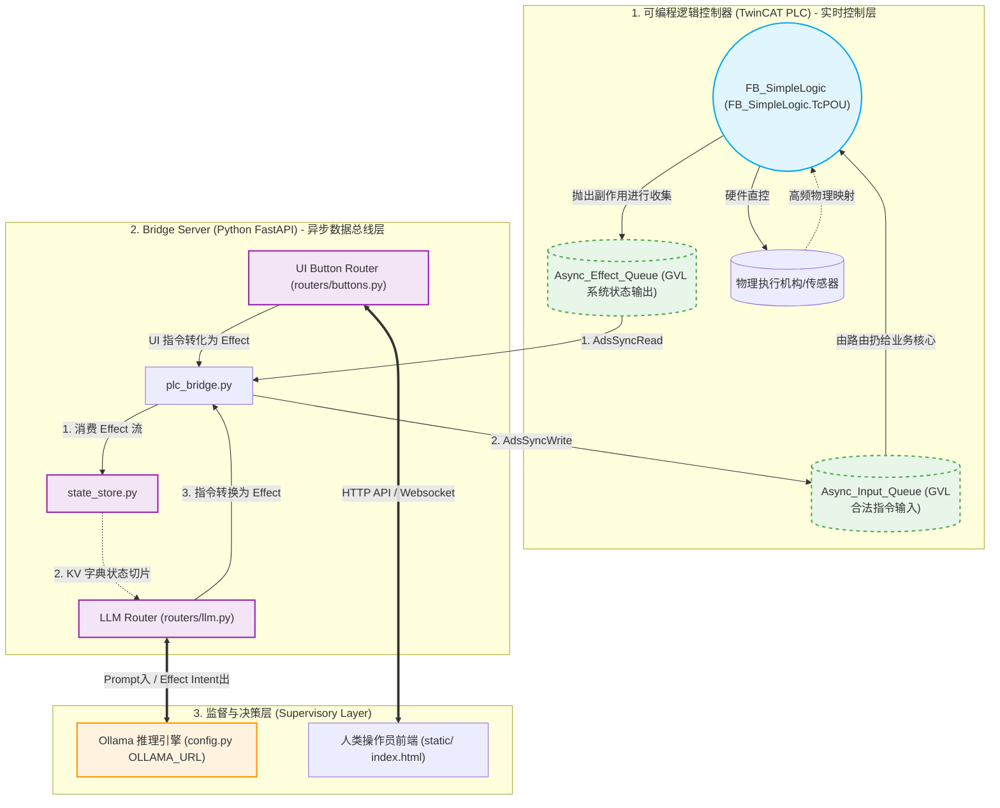

# MonoPLC：基于 Monoid 的 LLM 智能融合架构与接口规范

在 MonoPLC 前期的 [架构设计](MonoPLC_Architecture.md) 中，我们已经讨论了如何利用 Monoid 将“副作用（Side Effects）”与“纯业务逻辑”解耦。
本文档重点探讨在此基础上，**大语言模型（LLM）是如何自动感知系统状态的**，以及 **MonoPLC 架构是如何利用 Monoid 的优势，确保 LLM 接入后的系统健壮性与高度可扩展性**的。文档也将梳理各个部件的连接 Interface 及其具体代码实现位置。

---

## 1. 整体协同架构图

为了直观理解物理控制层、中间管道层与智能监控层之间的确切关系，请参考以下架构数据流向图：



---

## 2. LLM 如何自动获取系统信息？

在传统的系统设计中，为 LLM 提供状态往往需要硬编码大量特定变量（例如直接读取 `PLC.Termperature`）。而在 MonoPLC 中，这一过程完全是**泛型且自动化**的，极大提升了扩展性。

### 2.1 状态抓取链路 (StateStore Reconstructor)
LLM 不会直接读取 PLC 内部状态，而是依赖后台中间件（Bridge Server）的 `StateStore` 进行状态重建。
1. **纯净的队列导出**：
   PLC 会将所有的行为和状态更新统一通过返回 `DUT_Effect_Monoid` 写出到 `Async_Effect_Queue`。
2. **通用的键值对折叠**：
   在 `monoplc-server/state_store.py` 中，`_poll_loop` 函数通过轮询提取出这些 Effect，并根据联合主键 `(EType, Target)` 覆写最新的 Payload 和 Value，形成一个动态字典。**此处没有任何领域耦合**，无论是温度、压力还是新加入的视觉数据，只要遵守统一的 Effect 格式，都能被自动记录。

### 2.2 动态 Prompt 构建
当进行 LLM 推理请求时，信息会被动态注入（见 `monoplc-server/routers/llm.py`）：
```python
def _build_state_prompt(state: dict, user_input: str | None = None) -> str:
    lines = ["Current system state (JSON mapping):"]
    for key, value in state.items():
        val_str = json.dumps(value, ensure_ascii=False) if isinstance(...) else str(value)
        lines.append(f"- {key}: {val_str}")
    # ...
```
通过上述方式，LLM 在 `/api/llm/decide` 或 `/api/llm/chat` 请求时，能够看到完整的、与业务解偶的扁平化系统状态快照以及最近日志，实现了自动化的信息捕获。

---

## 3. 发挥 Monoid 的优势：保障健壮性与拓展性

LLM 的生成内容具有不确定性（幻觉），因此**绝对不能让 LLM 充当控制层**。
MonoPLC 结合 Monoid 完美的代数性质，确立了系统的核心安全边界。

### 3.1 健壮性保障：黑白名单与副作用拦截
系统的核心理念是：**LLM 是监控决策层（Supervisory Layer），PLC 的 FB_SimpleLogic 是唯一的实时控制层。**

通过在中间件定义严格的枚举与白名单拦截机制（见 `monoplc-server/models.py` 与 `monoplc-server/routers/llm.py`）：
1. **白名单模式 (`LLM_ALLOWED_EFFECTS`)**：
   允许 LLM 发出如 `EFF_SETPOINT_CHANGE` (修改预设值) 或 `EFF_IOT_CMD_START` 等“意图（Intent）”指令。
2. **硬件隔离拦截**：
   LLM **严格禁止**输出 `EFF_VALVE_CTRL` (直接操控硬件) 或 `EFF_ALARM` 等直接影响物理层的操作类型。如果 LLM 尝试这么做，`_validate_and_respond()` 函数会立刻拦截并报错。
3. **安全垫 (`FB_SimpleLogic.TcPOU`)**：
   即便 LLM 合法地发送了 `EFF_SETPOINT_CHANGE` 改变了温度上限，是否关阀依然是由 PLC 中的 `FB_SimpleLogic` 这一纯净的确定性逻辑模块负责的。它会依据自己的物理规则和心跳进行运算。外界不论输入多少狂躁的指令，都只能作为一个普通的 `Input_Event` 交给核心 PLC，绝不会导致内存崩溃或死锁。

### 3.2 拓展性保障：结合律与单位元
利用 Monoid 独有的**结合律**特性，添加新功能时**不需要更改现有主控循环**。
例如，当我们要加入一种新的 LLM 分析功能或软按钮时：
* 无论是来自 HMI（人机交互）、IoT 订阅还是 LLM (`routers/llm.py`) 处理后输出的决定，它们最终都被包装为同样的 `Effect` 格式。
* 在 PLC 端，它们只会被简单地扔进环形输入队列，最后利用 `FC_CombineEffects` 像加法一样顺理成章地合并处理。业务模块代码行数不会像“蜘蛛网”一般随接入维度的增加而疯狂膨胀。

---

## 4. 部件连接 Interface 及核心代码落点

为了实现上述机制，系统定义了一系列严格对齐的数据结构和通信接缝（Interface）：

### 4.1 跨端统一数据模型（Interface Contract）
通信的唯一定义标准是将 PLC 和 Python 服务器中的数据结构进行完美镜像。
* **Python 测代码**：`monoplc-server/models.py` (使用了 Pydantic 模型)
  * `class EffectType(IntEnum)` 对应 PLC 枚举 `ENUM_Effect_Type`
  * `class Effect(BaseModel)` 对应 `DUT_Effect`
  * `class EffectMonoid(BaseModel)` 对应 `DUT_Effect_Monoid`

### 4.2 各组件交互接口梳理

| 交互组件 A | 交互组件 B | 通信通道 & 协议 | 具体实现的文件位置 |
| :--- | :--- | :--- | :--- |
| **PLC 业务核心** | **本地事件总线** | Monoid `DUT_Effect` | `POUs/PLCLogic/FB_SimpleLogic.TcPOU` <br/> *(输入 `Input_Event: DUT_Effect` 输出 `Effects_Out: DUT_Effect_Monoid`)* |
| **Bridge Server** | **TwinCAT PLC** | Ads 读写环形队列 (`Async_Queue`) | `monoplc-server/plc_bridge.py` <br/> *(独家接口：`push_input_effect` 和 `pop_output_effects`)* |
| **Bridge Server** | **状态缓存** | 内存聚合结构 `SystemState` | `monoplc-server/state_store.py` <br/> *(解析 `pop_output_effects` 覆写至内存)* |
| **用户 / 前端** | **Bridge Server** | FastAPI REST 接口 (HTTP) | `monoplc-server/routers/buttons.py`<br/>`monoplc-server/routers/llm.py` |
| **Bridge Server** | **Ollama LLM 服务**| HTTP Request | `monoplc-server/routers/llm.py` <br/> *(`_call_ollama()` 指向 `/api/generate`)* |

### 4.3 请求生命周期举例（以 LLM 判断为例）
1. **状态获取**：用户调用 `/api/llm/decide`。
2. **上下文组装**：调用 `app_state.state_store.get_state()` 获取泛型字典。利用 `_build_state_prompt()` 生成 JSON 格式提示词传入 LLM。
3. **推理与白名单校验**：LLM 给出响应（反序列化为 `LLMActionResponse`），`_validate_and_respond()` 函数确认此操作属于非侵入式的 `LLM_ALLOWED_EFFECTS`。
4. **指令下发**：调用 `plc_bridge.push_input_effect(response.effect)` 将副作用封装为一个 `DUT_Effect` 推送到 ADS 的 `GVL.Async_Input_Queue` 中，供 PLC 在下一次循环被安全拾取。

通过这条优雅的回环，大语言模型以**极强的环境感知能力**和**不可越界的系统权限**完美融合进了高可靠的单片工业控制架构之中。
